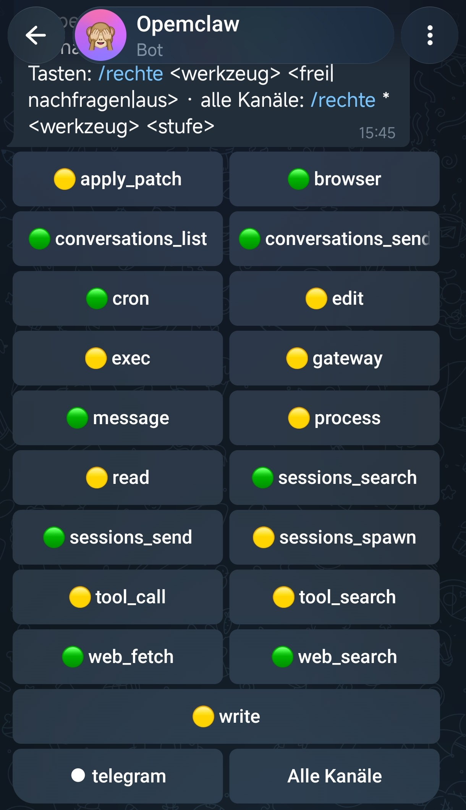
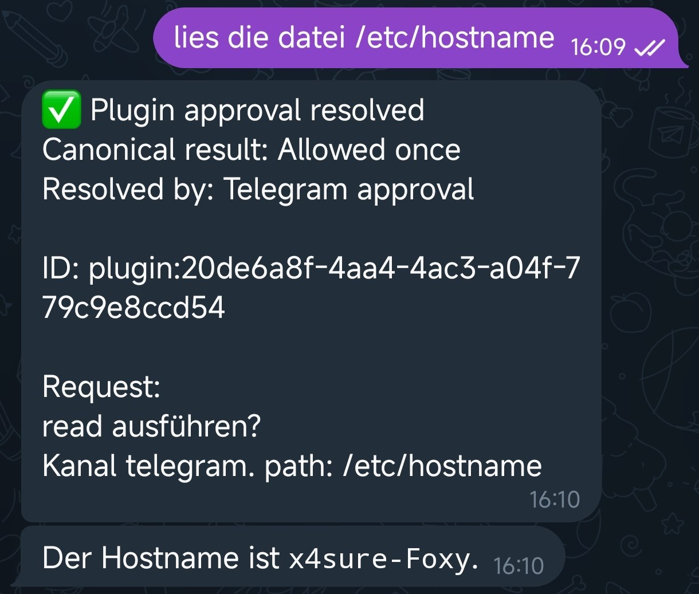

# Rechte ("rights") – a permissions table plugin for OpenClaw

*[Deutsche Fassung: README.md](README.md)*

One table that holds, per channel and per tool, one of three levels:

| Level | Meaning |
|---|---|
| 🟢 **allow** | runs without asking – exactly what OpenClaw does without this plugin |
| 🟡 **ask** | OpenClaw pauses and asks in the chat (buttons or `/approve`) |
| 🔴 **off** | is not executed – no matter what the model wants |

The table is shown in the chat with `/rights` and switched with buttons. Enforcement happens **in code**
(`before_tool_call` hook), not in the prompt: a tool that is "off" is not executed even if the model tries.



## Why

OpenClaw already has a lot: `tools.allow`/`tools.deny`, sandboxing, exec approvals. What is missing is **one
simple place** where you say, per channel, "this is fine, ask me for that, never do this" – and that you can
switch from your phone without touching a config file or restarting. That is this plugin. It mirrors a private
agent ("Foxy") where this exact table has been in daily use for months: the Telegram channel gets fewer rights
than the desk at home, and "ask" is the level people actually use most.

If you enable the plugin and configure nothing, nothing changes: the default is **allow**.

## Install

1. Put the folder anywhere (e.g. `~/projects/openclaw-rechte`) – no dependencies, no build step.
2. Add to `openclaw.json` (or your profile config):

```json
"plugins": {
  "load": { "paths": ["/path/to/openclaw-rechte"] },
  "allow": ["rechte", "telegram", "ollama", "…every other plugin you use…"],
  "entries": { "rechte": { "config": { "language": "en" } } }
}
```

   `plugins.allow` is an **exclusive** list: once present, OpenClaw loads only the plugins named there, so list
   everything you need (channels, model providers, …).
   `language` sets the language of the visible texts (`en` is the default, `de` German). Commands and level
   names are understood in both languages regardless.
3. Restart the gateway. `rechte` shows up in the plugin list in the log.

Tested with OpenClaw 2026.9.6, Node 24, the Telegram channel.

## Use

`/rights` and `/rechte` do the same. Levels are accepted in English or German: `allow`/`frei`, `ask`/`nachfragen`,
`off`/`aus`.

| Input | Effect |
|---|---|
| `/rights` | table for the current channel, with buttons |
| tap a button | next level (🟢 → 🟡 → 🔴 → 🟢); the same message is edited in place |
| button "All channels" | table for `*` (applies to every channel without its own entry) |
| `/rights exec ask` | set in the current channel |
| `/rights * web_fetch off` | set for all channels |
| `/rights show discord` | show another channel's table |
| `/rights default ask` | default for tools **without an entry** (new, still unknown tools); German: `standard` |

Type in lowercase – some phones autocorrect `/rights` to `/Rights`, which then goes to the model instead of
the command.

**Resolution order:** entry for the channel → entry for all channels (`*`) → default (`allow`, changeable with
`/rights default <level>`). If you want instructions to come from one channel only, set the default to "ask" or "off",
so a tool that is not in any table yet does not simply run.

Tools the model uses for the first time are added to the table automatically (list `bekannt`, "known") so they
show up on the next `/rights`.

## The table file

Lives at `<state-dir>/rechte/tabelle.json` (mode 600), written atomically (`.neu` first, then rename).
Levels are stored in English; an older table with `frei`/`nachfragen`/`aus` is translated on load.

```json
{
  "standard": "allow",
  "kanaele": {
    "*":        { "exec": "ask" },
    "telegram": { "exec": "off", "write": "ask" }
  },
  "bekannt": ["read", "exec", "web_search"]
}
```

If the file is corrupt, the plugin **blocks** every tool call with a message – better locked than silently open.

## Deliberate choices

- **"off" gives the model a reason** ("… is switched off in channel telegram. Do not try another way. Tell the
  user they can enable it with /rights.") – so the bot explains the block instead of guessing.
- **"ask" allows only `allow-once` and `deny`.** An "allow always" would bypass the table; if you want it
  permanent, switch the level.

  
- **The approval card shows parameters shortened**, keys such as `token`, `key`, `password` redacted.
- **Only the owner can switch** (`commands.ownerAllowFrom`). Button presses from anyone else are silently ignored.
- **Button presses go straight to the plugin**, not to the model (`registerInteractiveHandler`, namespace
  `rechte`). The model never sees them and cannot comment on them.
- **The agent cannot change the table itself.** It is outside its toolbox; only the command writes it.

## Limits (as of 2026-09-29)

- Buttons are built for and verified on **Telegram**. Other channels get the table as text and switch with
  `/rights <tool> <level>`; the button presentation should render elsewhere too, but that is untested.
- "ask" needs a channel that can show approvals. From the CLI (`openclaw agent`) and in runs with nobody to ask
  (heartbeat, automations) such a call aborts with a message – safe, but without the question. The model then
  sees a tool error and, depending on the model, may reply oddly; if you use heartbeats, keep the tools they need
  on "allow" or disable the heartbeat (`heartbeat.every: "0m"`).
- Identifiers in the code (files, functions, table fields) are German; the visible strings are bilingual. Renaming
  is mechanical if the project wants it.

## Layout and tests

- `rechte.js` – all the logic, no OpenClaw dependency (table, decision, command, buttons, texts en/de).
- `index.js` – the OpenClaw entry (`before_tool_call`, `/rights` + `/rechte`, button handler).
- `test/rechte.test.js` – 13 tests, `npm test` (Node only, no extra packages).

Verified live on 2026-09-29 in Telegram: show the table; all three levels (allow reads without asking, ask shows
the approval buttons and reads after "Allow", off is intercepted in code and explained to the user); buttons
cycle in place in the same message with no model reply.

## License

MIT – see `LICENSE`.
